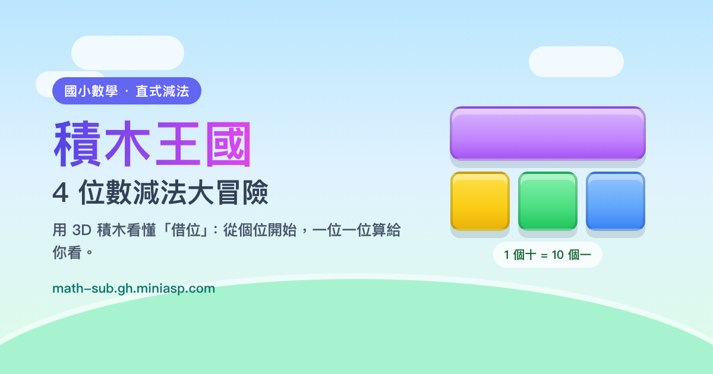

# 積木王國：4 位數減法大冒險

用 3D 積木學會「4 位數減法」與「借位」的互動遊戲，適合國小學童。

🔗 **線上遊玩：<https://math-sub.gh.miniasp.com/>**



## 這是什麼？

孩子學直式減法時，最難的是「為什麼不夠減就要向左邊借 1」。這個遊戲把每一個位值
做成看得見的 3D 積木：

| 位值 | 積木形狀 | 數量 |
| --- | --- | --- |
| 個位 | 小方塊 | 1 |
| 十位 | 長條 | 1 條 = 10 個 |
| 百位 | 平板 | 1 片 = 10 條 |
| 千位 | 大立方體 | 1 顆 = 10 片 |

按下「← 借 1」時，孩子會看到左邊的積木少 1、右邊多 10 塊，答案就藏在剩下的積木裡。

## 遊戲內容

- **五個關卡**：暖身村（不用借位）→ 借位森林（借 1 次）→ 連借山谷（借 2 次以上）→ 跨零城堡（遇到 0 要連續借位）→ 混合競技場。
- **每回合 5 題**，依錯誤次數給 1～3 顆星，成績存在瀏覽器裡（`localStorage`），不會上傳。
- **即時提示**：同一題錯 3 次會提示答案，貓頭鷹博士會說明卡在哪裡。
- **3D 積木即時變化**：借位、進位、拆除積木都有動畫，可以拖曳旋轉、滾輪縮放。
- **音效**：用 Web Audio API 即時合成，沒有額外音檔，可一鍵靜音（會記住設定）。

## 操作方式

- 用畫面上的數字鍵盤，或直接按實體鍵盤的 `0`～`9` 作答。
- 上方 `🔭 全景`、`個位`～`千位` 按鈕可切換 3D 鏡頭視角。
- `？` 開啟「借位小秘訣」，按 `Esc` 或點「我知道了！」關閉。
- 喇叭圖示可切換音效。

## 開發

需要 Node.js 20 以上。

```bash
make install     # 安裝相依套件
make dev         # 啟動開發伺服器（Vite）
make typecheck   # TypeScript 型別檢查
make test        # 遊戲邏輯單元測試（Vitest）
make build       # 產生 dist/（單一 HTML 檔）
make preview     # 預覽建置結果
make check       # typecheck + test + build
make assets      # 重新產生 favicon 與分享卡片（需要 Chrome）
```

沒有 `make` 也可以直接用 `npm run dev` / `npm test` / `npm run build`。

### 專案結構

```
src/
├── App.tsx                 # 畫面切換與最佳成績儲存
├── game/logic.ts           # 出題與借位判斷（純函式，可單獨測試）
├── game/logic.test.ts      # 關卡規則與借位邏輯的測試
├── game/sound.ts           # Web Audio 音效
├── components/BlockScene.tsx   # 3D 積木場景（react-three-fiber）
├── components/ColumnBoard.tsx  # 直式算式面板與借位按鈕
├── components/NumPad.tsx       # 數字鍵盤
├── components/Mascot.tsx       # 貓頭鷹博士與狀態播報
├── screens/                # 首頁 / 遊戲 / 結算畫面
design/social-card.html     # 分享卡片設計稿（1200×630）
public/                     # favicon、PWA 圖示、manifest、robots、sitemap、CNAME
scripts/generate-assets.mjs # 用 Chrome 產生圖示與分享卡片
```

網站的 `<title>`、description、canonical、OpenGraph、Twitter Card、JSON-LD、
`site.webmanifest` 與 sitemap 都是針對正式網域 `https://math-sub.gh.miniasp.com/` 設定。

## 部署

推送到 `main` 分支後，[`.github/workflows/deploy.yml`](.github/workflows/deploy.yml)
會依序執行 `npm ci` → `npm test` → `npm run build`，再把 `dist/` 部署到 GitHub Pages。

- 自訂網域：`math-sub.gh.miniasp.com`（`public/CNAME` 會一起打包進 `dist/`）
- DNS 需要一筆 CNAME 記錄：`math-sub.gh.miniasp.com` → `doggy8088.github.io`
- HTTPS 憑證由 GitHub 自動申請，DNS 生效後可能需要幾分鐘到一小時。

## 無障礙

- 所有按鈕都有無障礙名稱，關卡按鈕會唸出關卡名稱與最佳成績。
- 貓頭鷹博士的提示是 `role="status"` + `aria-live="polite"`，會自動被螢幕閱讀器唸出來。
- 可以只用鍵盤遊玩（`0`～`9` 作答、`Esc` 關閉說明視窗，關閉後焦點回到原按鈕）。
- 支援系統的「減少動態效果」設定：會停用彩帶、鏡頭飛行與裝飾動畫。
- 3D 場景只是輔助說明，算式面板與數字鍵盤都是可讀的文字與按鈕。

## 已知限制

- 3D 場景需要瀏覽器支援 WebGL；不支援時其他操作仍可用，但看不到積木。
- 音效需要使用者先與畫面互動（瀏覽器自動播放政策）。
- 成績只存在單一瀏覽器，換裝置或清除網站資料就會歸零。
- 目前只有四位數減法（被減數 1200–9999），沒有除法／乘法。

## 授權

[MIT](LICENSE) © 2026 [Will 保哥的技術交流中心](https://www.facebook.com/will.fans/)
